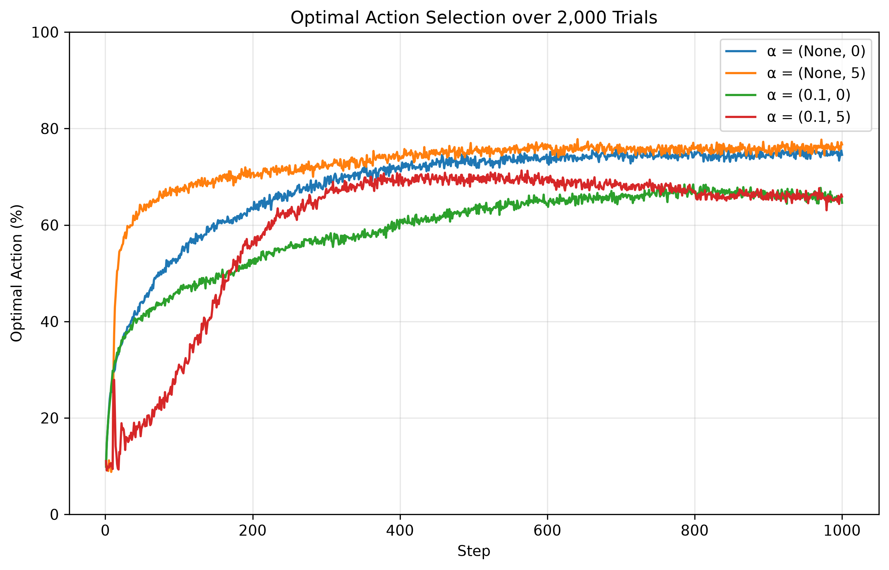
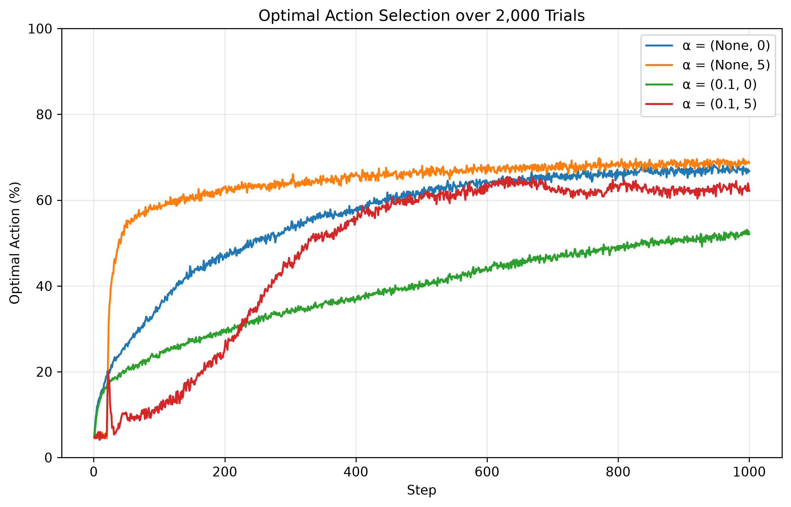

# Exercise 4

## Concept

This exercise studies two distinct ideas in action-value methods: optimistic initial values as a mechanism for exploration, and constant step sizes as a mechanism for tracking nonstationary rewards. In a drifting bandit problem, the agent must both discover good actions and keep adapting after the identity of the best action changes.

The action-value update used in the code is

$$
Q_{t+1}(A_t)
=
Q_t(A_t)
+
\beta_t\left[R_t-Q_t(A_t)\right],
$$

where $\beta_t = 1/N_t(A_t)$ for the sample-average method and $\beta_t = \alpha = 0.1$ for the constant-step-size method. The sample-average rule gives equal weight to all past rewards for an action, so in a nonstationary problem it becomes increasingly slow to respond. A constant step size keeps recency weighting, so recent rewards matter more and the estimate can follow drift.

Optimistic initialization changes behavior before much data has been collected. If all estimates start at $Q_1(a)=5$, then any action that has not yet been tried remains artificially attractive. After one ordinary reward sample, the selected action's estimate drops, while untouched actions still look better. Thus a nearly greedy agent is driven to explore without adding extra randomness to the policy itself.

## Exercise Summary

The source file is `reinforcement_learning/playground/exercise004.py`. It defines a nonstationary $k$-armed bandit in which each run begins with true action values drawn from $\mathcal{N}(0,1)$. After every step, all true values drift according to independent Gaussian increments with standard deviation $0.01$. Rewards are sampled from $\mathcal{N}(q_*(a),1)$.

Each experiment uses an $\varepsilon$-greedy agent with $\varepsilon=0.1$ and compares four conditions:

- sample-average updates with $Q_1(a)=0$;
- sample-average updates with $Q_1(a)=5$;
- constant step size $\alpha=0.1$ with $Q_1(a)=0$;
- constant step size $\alpha=0.1$ with $Q_1(a)=5$.

The code averages over `2000` runs of `1000` steps and reports both average reward and percentage of optimal actions for `k=10` and `k=20` arms.

### Ten arms (`k = 10`)

**Results.** The horizontal axis is step and the vertical axis is average reward. The four curves correspond to `(sample average, 0)`, `(sample average, 5)`, `(alpha=0.1, 0)`, and `(alpha=0.1, 5)`, as encoded in the legend tuples. The optimistic sample-average method rises fastest because the initial value `5` forces a rapid sweep through the actions, so the agent finds strong actions early. The optimistic constant-step-size method begins badly because its first few rewards are far below the optimistic prior, producing a sharp correction phase, but later it catches up and slightly overtakes in reward because constant step sizes track drifting action values better than sample averages.

**Results.** Here the vertical axis is the percentage of times the optimal action is selected. The optimistic curves show a clear transient near step `11`, which is approximately `k+1`. That occurs because, aside from occasional `\varepsilon` exploration, the agent is pushed to sample each of the `10` actions once while untried actions still retain the optimistic estimate. After this forced survey, greedy choice is made among estimates that now differ, so the probability of selecting the true best action jumps. Over longer horizons, the sample-average optimistic method attains the highest optimal-action rate, while the constant-step-size methods sacrifice some instantaneous optimality in exchange for faster adaptation to reward drift.

### Twenty arms (`k = 20`)

**Results.** With `20` actions, optimism is even more valuable early because a neutral estimate leaves more alternatives to sort through. The optimistic sample-average method again gains reward quickly, while the optimistic constant-step-size method spends roughly the first `20` steps correcting its inflated estimates. Later, however, the constant-step-size optimistic curve becomes the best in average reward. This is the expected nonstationary advantage of recency weighting: even if the agent does not choose the instantaneous optimal arm most often, its value estimates remain more responsive to recently improving actions.

**Results.** The same exploration spike now appears near step `21`, reflecting the larger action set. The optimistic sample-average method achieves the highest optimal-action percentage throughout most of the run, because optimism quickly identifies promising actions and the larger number of arms makes that initial directed exploration especially useful. The non-optimistic constant-step-size method performs worst here: with many actions and only `\varepsilon=0.1` exploration, discovering the best arm is slow, even though its update rule can track drift once good actions are found. The gap between reward and optimal-action performance in the late part of the run is the main lesson: in a nonstationary bandit, the method that tracks current rewards best need not be the one that most often matches the instantaneous argmax of `q_*(a)`.
