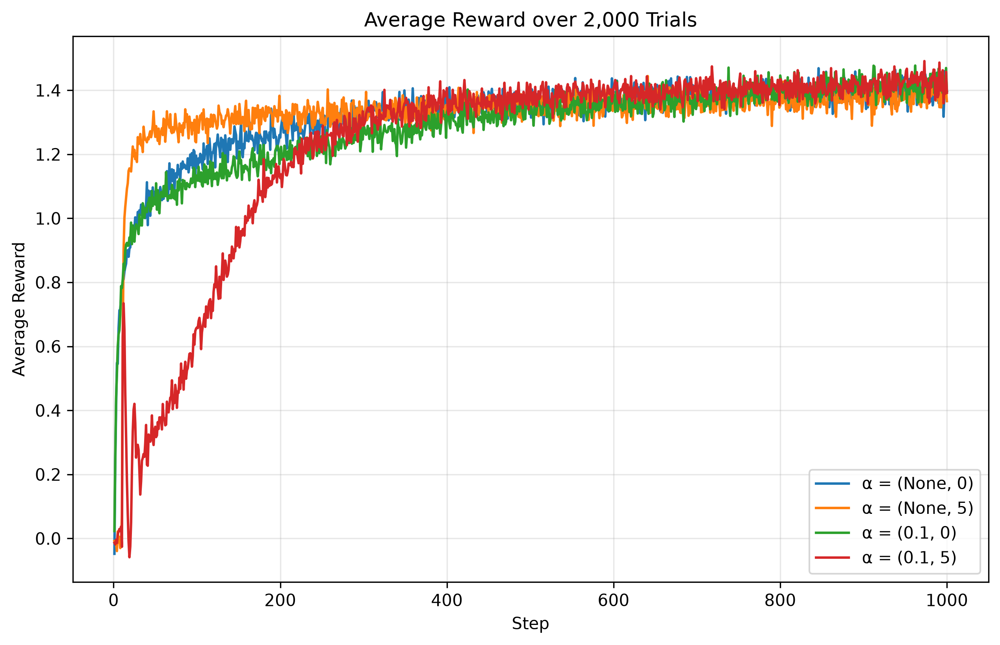
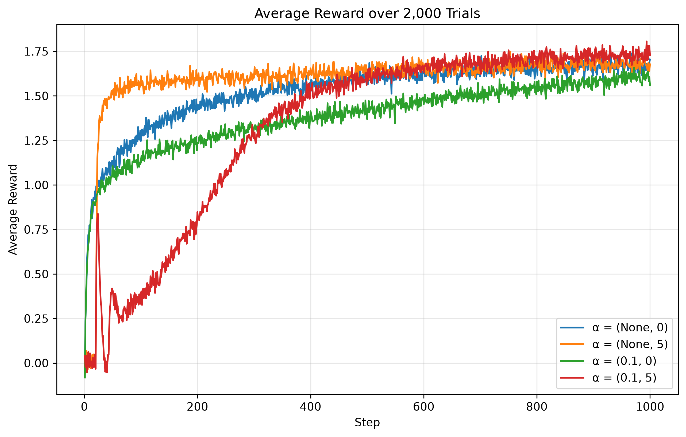

# Exercise 3

Average reward across trials for ε ∈ `{0.0, 0.01, 0.1}` (default script settings: 2000 trials, 1000 steps):

{width=750x fig-align="center"}

Percent of optimal actions selected over the same runs:

{width=750x fig-align="center"}

Percent of optimal actions selected over the same runs:

