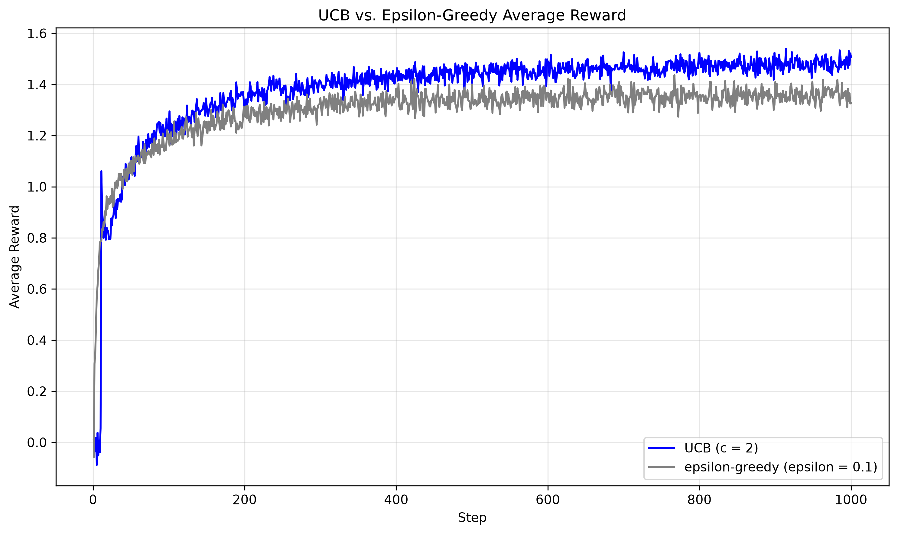

# Exercise 5

## Upper-Confidence-Bound Action Selection

The upper-confidence-bound (UCB) strategy balances exploitation and exploration using one score for each action:

$$
U_t(a) = Q_t(a) + c\sqrt{\frac{\ln t}{N_t(a)}}.
$$

Here, $Q_t(a)$ is the estimated action value, $N_t(a)$ is the number of times action $a$ has been selected, $t$ is the current step, and $c$ controls the strength of exploration. The first term favors actions with high observed rewards. The second term is an uncertainty bonus: actions selected less often receive a larger bonus. Unlike $\varepsilon$-greedy, UCB does not explore by choosing uniformly at random. It explores actions whose value estimates are still uncertain.

The implementation selects every untried action before applying the formula. Once all actions have been sampled, it selects the action with the largest UCB score and updates its value using an incremental sample average.

## Exercise Summary

`reinforcement_learning/playground/exercise005.py` compares UCB with $\varepsilon$-greedy action selection in a stationary 10-armed bandit. At the start of each trial, the true mean reward of every action is sampled from $\mathcal{N}(0,1)$, and each observed reward is a noisy sample with standard deviation $1$.

Both agents use sample-average action-value updates. UCB uses $c=2$, while $\varepsilon$-greedy uses $\varepsilon=0.1$. Each method is run for 2,000 trials of 1,000 steps. The agents face the same true action values within each trial, and the program plots their average reward against the step number.

**Results.** The x-axis is the step and the y-axis is average reward. UCB is shown in blue and $\varepsilon$-greedy is shown in gray. UCB obtains higher average reward after its initial exploration phase because its uncertainty bonus directs additional trials toward actions that have not yet been estimated reliably. Epsilon-greedy continues to select a random action 10% of the time, including actions that already have good or poor estimates, so some exploration is less informative.

## Why Does UCB Spike on the Eleventh Step?

For this experiment there are $k=10$ actions. During the first ten steps, the implementation gives priority to actions with $N_t(a)=0$, so each action is sampled exactly once in the usual UCB trajectory. At the beginning of step 11, all actions therefore have $N_{11}(a)=1$. Their uncertainty bonuses are equal:

$$
c\sqrt{\frac{\ln 11}{N_{11}(a)}} = c\sqrt{\ln 11}.
$$

Because this common term does not affect the ordering, UCB chooses the action with the largest observed reward from the first ten samples. That action is more likely than a uniformly selected action to be the true best action: the action with the largest sample is often the one with the largest underlying mean. Consequently, the reward averaged over many trials rises sharply on step 11. The spike is therefore not caused by the bonus making one particular action preferable; it is caused by the end of the initial one-sample-per-action survey and the first exploitation choice based on unequal estimates.

The drop on the following steps has the opposite cause. After the action selected on step 11 is used, its count becomes $N(a)=2$. At step 12 its uncertainty bonus is approximately

$$
c\sqrt{\frac{\ln 12}{2}},
$$

whereas every action not selected since the initial survey still has count one and receives

$$
c\sqrt{\ln 12}.
$$

For $c=2$, this difference is large enough that UCB often leaves the apparently best action and samples another action with greater uncertainty. That action may have a lower true mean, so average reward decreases after the spike. The same process continues: selecting an action reduces its uncertainty bonus, making other insufficiently sampled actions comparatively attractive. The resulting temporary reduction in reward is the cost of UCB's directed exploration.

With $c=1$, the uncertainty bonus has half the magnitude. The step-11 choice is still based on the largest first sample because all ten bonuses are equal at that point, but after step 11 the reduction in the selected action's UCB score has less influence relative to its estimated value. UCB is less forceful about revisiting uncertain actions, so it spends less time sampling arms with lower estimated means. The post-spike decrease is consequently less pronounced, and the spike appears less prominent as a performance contrast. The parameter $c$ therefore controls how strongly UCB trades immediate reward for information.
