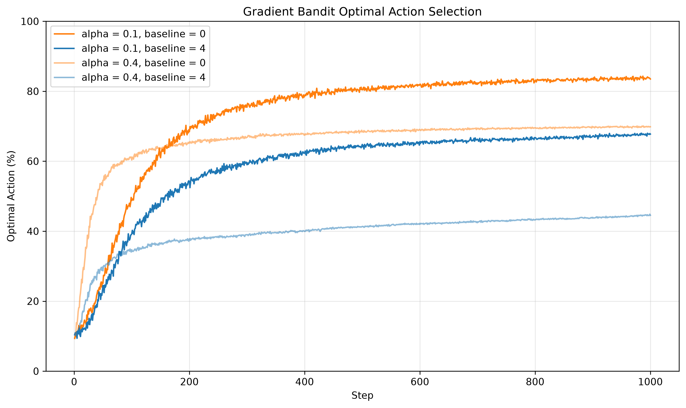

# Exercise 6

## Concept

A gradient bandit learns **action preferences**, not estimates of expected rewards. Each action has a preference $H_t(a)$, and the agent samples its action from the softmax policy:

$$
\pi_t(a)=\Pr(A_t=a)=\frac{e^{H_t(a)}}{\sum_b e^{H_t(b)}}.
$$

Higher preferences give higher selection probabilities, but only preference differences matter. Adding the same constant to every preference leaves the policy unchanged. The implementation exploits this property by subtracting the largest preference before exponentiation, avoiding overflow without changing the probabilities. Initially all preferences are zero, so each of the ten actions has probability $0.1$. Exploration comes from sampling this distribution, rather than from an additional $\varepsilon$-greedy rule.

After selecting $A_t$ and observing reward $R_t$, the agent updates every preference:

$$
H_{t+1}(a)=H_t(a)+\alpha(R_t-b)
\left[\mathbf{1}\{a=A_t\}-\pi_t(a)\right].
$$

Here $\alpha$ is the step size and $b$ is a reward baseline. If the reward exceeds the baseline, the selected action's preference increases by $\alpha(R_t-b)(1-\pi_t(A_t))$, while each unselected action's preference decreases by $\alpha(R_t-b)\pi_t(a)$. A below-baseline reward reverses these changes. Thus the update reinforces or discourages an action relative to a reference reward; it does not move a reward estimate toward an observation.

### Why the Baseline Matters

An action-independent baseline does not change the expected policy-gradient direction. Conditional on the current policy, its contribution cancels because

$$
\mathbb{E}_{A_t\sim\pi_t}\left[b\left(\mathbf{1}\{a=A_t\}-\pi_t(a)\right)\right]
=b\left(\pi_t(a)-\pi_t(a)\right)=0.
$$

In this stationary bandit, the expected update is therefore

$$
\mathbb{E}[\Delta H_t(a)\mid H_t]
=\alpha\pi_t(a)\left[q_*(a)-\sum_c\pi_t(c)q_*(c)\right],
$$

where $q_*(a)$ is the true mean reward. Actions better than the current policy's expected reward gain preference on average, even if their individual rewards usually fall below the baseline.

The baseline nevertheless changes the variability of sampled updates. A poorly placed baseline can produce large, noisy changes, especially with a large step size. **This exercise uses fixed baselines of $0$ and $4$, not a running average reward.** Its true action values are centered at zero; baseline $4$ does not shift the environment's rewards upward. Consequently, most rewards fall below $4$, often discouraging the sampled action even when it is relatively good. Cancellation in expectation does not make the finite-sample learning trajectories identical.

## Exercise Summary

`reinforcement_learning/playground/exercise006.py` compares four gradient-bandit configurations:

- A stationary 10-armed bandit, with true action values $q_*(a)\sim\mathcal{N}(0,1)$ sampled independently at each trial's start.
- Observed rewards $R_t\mid A_t=a\sim\mathcal{N}(q_*(a),1)$.
- Step sizes $\alpha\in\{0.1,0.4\}$ crossed with fixed baselines $b\in\{0,4\}$.
- Zero initial preferences, 2,000 independent trials, and 1,000 steps per trial; `main()` sets the random seed to `42`.

Within each trial, all configurations face the same true action values but sample their own actions and rewards. The experiment computes both average reward and the percentage of trials selecting the true optimal action. The current plotting function saves only the optimal-action percentage figure.

**Results.** The horizontal axis is the step; the vertical axis is the percentage of trials selecting the action with the highest true mean reward. Orange curves use baseline $0$, and blue curves use baseline $4$; full-opacity curves use $\alpha=0.1$, and lighter curves use $\alpha=0.4$. All begin near the uniform policy's 10% success rate. With baseline $0$, the larger step size improves faster initially, but the smaller step size overtakes it and reaches roughly 84% by step 1,000, compared with about 70% for $\alpha=0.4$. Larger updates rapidly concentrate the policy, but noisy early rewards can favor a suboptimal action, making alternatives less likely to be sampled and slowing correction. Smaller updates preserve broader sampling longer and achieve better later performance in this experiment.

**Baseline comparison.** Baseline $4$ performs worse at both step sizes, ending near 68% for $\alpha=0.1$ and 45% for $\alpha=0.4$. Its large reward deviations amplify noisy preference changes, with the larger step size magnifying that effect. The light-blue curve initially rises faster than the dark-blue curve but is soon overtaken. These results illustrate the interaction between baseline choice and step size, not a general failure of reward baselines: a suitable baseline can reduce gradient noise. The curves cover only 1,000 steps and do not establish asymptotic limits.

## Two Actions: Softmax Is a Sigmoid

For two actions with preferences $H_1$ and $H_2$, softmax assigns action 1 probability

$$
\begin{aligned}
\pi(1)
&=\frac{e^{H_1}}{e^{H_1}+e^{H_2}}\\
&=\frac{1}{1+e^{H_2-H_1}}\\
&=\sigma(H_1-H_2),
\end{aligned}
$$

where the logistic, or sigmoid, function is

$$
\sigma(x)=\frac{1}{1+e^{-x}}.
$$

The other action has probability

$$
\pi(2)=\sigma(H_2-H_1)=1-\sigma(H_1-H_2).
$$

Thus a two-action softmax is exactly a Bernoulli distribution whose success probability is the sigmoid of the **preference difference**, not generally the sigmoid of either preference alone. Equivalently,

$$
\log\frac{\pi(1)}{\pi(2)}=H_1-H_2.
$$

The preference difference is the log-odds, just as the linear predictor is the log-odds in logistic regression or a binary-output neural network. Equal preferences give probability $1/2$; an increasingly positive difference favors action 1. By shift invariance, one may set $H_2=0$ without loss of generality, obtaining the familiar form $\pi(1)=\sigma(H_1)$. If softmax includes a temperature $\tau>0$, the corresponding probability is $\sigma((H_1-H_2)/\tau)$; this implementation uses $\tau=1$.
