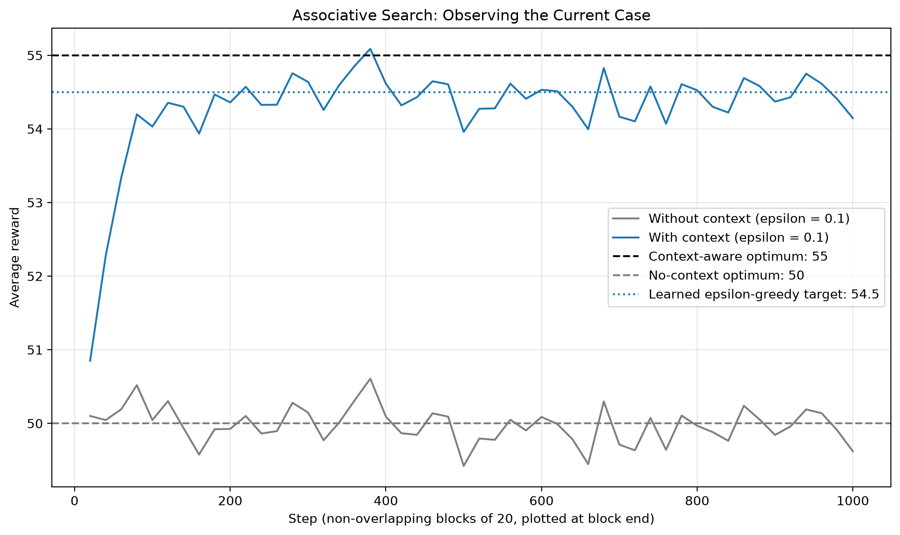
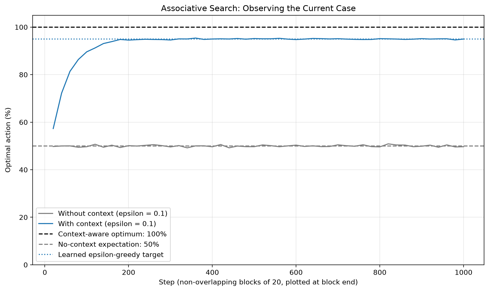

# Exercise 7 — Associative Search

## Concept

An **associative search**, or **contextual bandit**, learns which action is best *in each observed situation*. Instead of finding one globally preferred action, the agent learns a policy that associates a context with an action. The cue identifies the situation, but it does not reveal the action values: the agent must still discover good actions through trial and error. This exercise implements the setting in Sutton and Barto, Section 2.9, using the two cases from Exercise 2.10 in the supplied image.

Let $S_t$ denote the context observed before choosing action $A_t$. The true contextual action value is

$$
q_*(s,a)=\mathbb{E}[R_t\mid S_t=s,A_t=a].
$$

The learner maintains separate estimates $Q_t(s,a)$ and visit counts for each context-action pair. After observing a reward, only the selected pair is updated using an incremental sample average:

$$
\begin{aligned}
N_{t+1}(S_t,A_t)&=N_t(S_t,A_t)+1,\\
Q_{t+1}(S_t,A_t)&=Q_t(S_t,A_t)
+\frac{R_t-Q_t(S_t,A_t)}{N_{t+1}(S_t,A_t)}.
\end{aligned}
$$

Action selection is $\varepsilon$-greedy within the current context: with probability $\varepsilon$, select uniformly among all actions; otherwise select an action maximizing $Q_t(S_t,a)$, breaking ties uniformly. Thus **search** discovers the best actions, while **association** keeps the discoveries specific to the situations in which they apply. Pooling all rewards into one table discards this information.

This remains a bandit problem because actions affect only immediate reward, not the next context. Contexts are sampled independently on each step. Although the active case changes, the reward distribution conditional on each context-action pair is stationary, so sample averages are appropriate. Without the cue, the agent sees a stationary mixture of the cases rather than a predictable sequence it can track. If actions also influenced future situations, immediate-reward maximization would no longer generally solve the problem.

## Exercise 2.10: Solution

The two cases occur independently with equal probability:

| Context | Probability | $q_*(s,1)$ | $q_*(s,2)$ | Best action |
| --------- | ------------- | ------------ | ------------ | ------------- |
| A | $0.5$ | $10$ | $20$ | Action 2 |
| B | $0.5$ | $90$ | $80$ | Action 1 |

### Without Knowing the Current Case

The expected reward of each action averages over the unobserved case:

$$
\begin{aligned}
\mathbb{E}[R_t\mid A_t=1]&=0.5(10)+0.5(90)=50,\\
\mathbb{E}[R_t\mid A_t=2]&=0.5(20)+0.5(80)=50.
\end{aligned}
$$

If the agent selects action 1 with probability $p$, its expected reward is

$$
p(50)+(1-p)(50)=\boxed{50}.
$$

**Either action, or any mixture of them, is optimal without the cue.** This also holds for choices based on past rewards: the next case is independent of that history. A reward might identify the case retrospectively, but it arrives too late to change the action already taken and does not predict the next case. No history-based strategy can raise the expected reward above 50 under these assumptions.

### With the Case Revealed Before Acting

Once the values have been learned, choose action 2 in case A and action 1 in case B. The best expected reward becomes

$$
0.5\max(10,20)+0.5\max(90,80)
=0.5(20)+0.5(90)=\boxed{55}.
$$

The learner is told only the case identity, not the values in the table. It must explore both actions in each case and learn their conditional means. After learning, exploiting the context-dependent best action achieves expected reward 55; continued exploration incurs a cost. A diminishing exploration schedule can approach 55 while still sampling every context-action pair sufficiently often.

In general, the distinction is **maximizing after observing context** versus **maximizing an average over hidden contexts**:

$$
\underbrace{\max_a\sum_s p(s)q_*(s,a)}_{\text{without context}}
\;\leq\;
\underbrace{\sum_s p(s)\max_a q_*(s,a)}_{\text{with context}}.
$$

The reusable function `optimal_expected_rewards()` computes these two benchmarks. Here, the cue is worth $55-50=5$ expected reward units per step. It does not increase either action's rewards; it allows the agent to choose the better action for the case actually present.

## Exercise Summary

`reinforcement_learning/playground/exercise007.py` compares two otherwise identical learners:

- **Without context:** one row of action-value estimates, updated using rewards from both cases. The agent always receives the same dummy context.
- **With context:** one row per case, with the current case revealed before action selection.

Both start with zero estimates, use $\varepsilon=0.1$, and learn through sample-average updates. The experiment runs **1,000 independent trials of 1,000 steps**, with seed `42`. Each step draws case A or B with probability $0.5$, independently of actions and past cases. Rewards are Gaussian with the table's mean and standard deviation $1$. This noise model is an implementation choice: Exercise 2.10 specifies the means, not a reward distribution.

Within each trial, both learners face the same case sequence and the same sampled potential rewards; if they select the same action on the same step, they receive the same reward. Each learner sees only its own selected action's reward. True values are used by the simulator and evaluator, never supplied to the learners. Python action indices `0` and `1` correspond to textbook actions 1 and 2.

### Average Reward



**Results.** The horizontal axis is the step, shown in non-overlapping 20-step blocks at each block's endpoint; the vertical axis is reward averaged over trials and steps in that block. The gray learner remains near its no-context optimum of 50. The blue contextual learner improves rapidly as exploration reveals the better action in each case. Zero initialization initially favors repeating the first positively rewarded action over an untried action with estimate zero; exploration is needed to correct an initially wrong preference. Keeping separate estimates then lets the agent exploit action 2 in A and action 1 in B, raising reward toward 54.5.

The black dashed line marks the context-aware optimum of 55, the gray dashed line marks 50, and the blue dotted line marks the learned $\varepsilon$-greedy target. After the correct actions are identified, exploration chooses the inferior action with probability $\varepsilon/2=0.05$. The reward gap between actions is 10 in either case, so

$$
\mathbb{E}[R_t]=55-10\left(\frac{0.1}{2}\right)=54.5.
$$

The remaining gap is an exploration cost, not missing contextual information. Shared rises and dips in the reward curves mainly reflect the shared random case sequence: case B yields much larger rewards than case A. Finite blocks with more B cases can even briefly exceed the expected optimum of 55; that optimum is an expectation, not a bound on individual rewards or finite-sample averages.

### Optimal-Action Selection



**Results.** The horizontal axis uses the same 20-step blocks, and the vertical axis is the percentage of actions that are best for the **actual current case**. The blue contextual learner rises toward 95%, the dotted reference, because it exploits correctly 90% of the time and also chooses correctly on half of its exploratory steps: $1-\varepsilon+\varepsilon/2=0.95$. The black dashed reference is 100%, achievable with a learned greedy contextual policy. The gray learner stays near the dashed 50% reference because its chosen action cannot depend on the independently drawn hidden case. This does not mean it is failing at its own information-limited task: both actions are equally good in expectation without the cue.

For the seeded run, performance over the final 200 steps was:

| Learner | Average reward | Contextually optimal action |
| --------- | ---------------- | ----------------------------- |
| Without context | 49.959 | 50.07% |
| With context | 54.451 | 94.96% |

These finite-run measurements agree with the respective targets of 50 and 54.5 reward, and 50% and 95% contextual-optimal-action selection.

## Running and Reusing the Code

From the project root, with the repository's NumPy and Matplotlib dependencies installed:

```bash
python -m reinforcement_learning.playground.exercise007
```

For a headless run, prefix the command with `MPLBACKEND=Agg`. The script prints the analytical answers and empirical summary and saves both plots in `docs/exercises/assets/`; it does not open a GUI window.

The reusable module is `reinforcement_learning/contextual_bandits.py`:

- `ContextualBanditAgent`: separate sample-average estimates and counts for arbitrary numbers of contexts and actions; one context recovers an ordinary bandit agent.
- `optimal_expected_rewards`: calculates known-value optimal expected rewards with and without context for a supplied action-value table and context probabilities.

The agent reuses `epsilon_greedy()` from `reinforcement_learning/policies.py`. Tests in `tests/test_contextual_bandits.py` and `tests/test_exercise007.py` cover the analytical answers, context-specific updates, action selection, validation, reproducibility, learning behavior, and figure generation.
