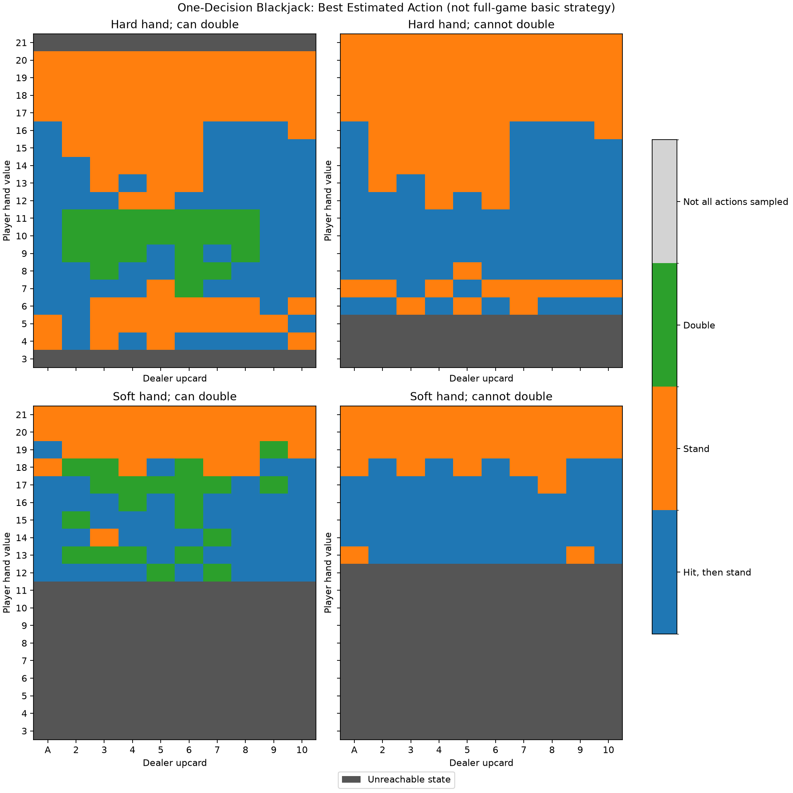

# Exercise 8 — One-Decision Blackjack

## Concept

This exercise uses **associative search** to learn the expected reward of an action in a blackjack situation. Its context is

$$
s=(\text{hand value},\ \text{is soft},\ \text{dealer upcard},\ \text{can double}).
$$

A soft hand has an ace currently counted as eleven. For example, A–4 is soft 15; after drawing a ten, it becomes hard 15. The dealer upcard is encoded as 1 for an ace and 10 for any of 10, J, Q, or K. The dealer's hole card is never included in the learner's context.

**The player makes exactly one decision.** Hit means draw one card and then stand automatically. Double means draw one card and then stand at twice the stake. The dealer completes its fixed policy, producing the reward for the selected action. Thus this is a contextual bandit with a sampled outcome, not full sequential blackjack learning. In particular, the learned value of hit excludes the option of hitting again.

For each legal state-action pair, the agent estimates

$$
q(s,a)=\mathbb{E}[R\mid S=s,A=a]
$$

using a sample average:

$$
N(s,a)\leftarrow N(s,a)+1,
\qquad
Q(s,a)\leftarrow Q(s,a)+\frac{R-Q(s,a)}{N(s,a)}.
$$

There is no next-state bootstrap or discount factor. An $\varepsilon$-greedy policy explores only legal actions and otherwise selects a legal action with the largest estimate. Estimates and counts are kept separately for every context.

## Rules

- Every card is drawn independently with replacement: ace through nine each have probability $1/13$, and ten-valued cards have probability $4/13$. No card counting or finite-deck depletion is modeled.
- The dealer hits below 17 and **stands on soft 17**.
- Double is allowed only on the initial two-card hand, on any total. It draws exactly one card.
- An ordinary win pays **+1**, a loss **−1**, and a push **0**. Doubling changes these to **+2**, **−2**, and **0**.
- Standing on an **initial two-card 21 pays +1.5**, unless the dealer also has a two-card blackjack, in which case it is a push. The bonus is forfeited by hitting or doubling. A later 21 is not blackjack.
- Dealer blackjack beats all non-natural player hands, including a multi-card 21. There is **no dealer peek before the player's decision**, so a double can lose the full two-unit stake to dealer blackjack.
- Player bust loses immediately; the dealer need not draw. A standing player blackjack can also be settled immediately after checking the dealer's initial hand.
- Splitting, surrender, and insurance are not available.

## Starting States and Reachability

Starting only with two cards would make `can_double=True` on every learning round. To also estimate values when doubling is unavailable, training chooses a two-card or three-card starting hand with equal probability. Busted three-card starts are discarded and redealt with the same hand length. These **exploring starts** supply contexts; they do not add earlier learned actions or rewards to the round. `OneDecisionBlackjack.reset(2)` instead deals only ordinary two-card starts.

Under the infinite-deck and one-action rules, total, softness, upcard, and doubling availability are sufficient: different card compositions with these same features have the same future reward distribution. Three-card starts cover all total/softness combinations possible after more than two cards.

The table reserves totals **3 through 21**, but some combinations are impossible. A–2 is soft 13, not a decision total of 3. The minimum two-card hard total is 4; the minimum three-card hard total is 6. Two-card soft totals start at 12, while three-card soft totals start at 13. Hard 21 cannot be an initial two-card hand.

There are **520 reachable contexts** and **1,310 legal state-action pairs**. Unreachable cells are not trained, and illegal doubles are excluded from both exploration and exploitation.

## Experiment and Results

`reinforcement_learning/playground/exercise008.py` trains for **1,000,000 one-action rounds**, with $\varepsilon=0.2$, seed `42`, and zero initial estimates. Each round updates exactly one state-action pair. All 1,310 legal pairs were visited in the generated run, but their counts ranged from **1 to 17,543**: visiting every pair does not mean every estimate is accurate.



**Results.** The horizontal axis is the dealer upcard and the vertical axis is the player total. Rows distinguish hard and soft hands; columns distinguish whether doubling is available. Blue means hit once then stand, orange means stand, and green means double. Dark gray marks impossible states; light gray would mark reachable states where not every legal action has been sampled. High hard totals favor standing because another card often busts. Doubling appears around favorable drawing totals, such as hard 10–11 against several dealer upcards, because it increases the stake on a positive expected outcome. Standing on an initial soft 21 preserves the blackjack bonus.

The irregular boundaries and isolated choices should not be read as an exact strategy chart. Rare contexts and exploratory actions can have noisy estimates. Some choices are also genuinely tied: from hard 4 or 5, neither standing nor drawing just one card can reach 17, so both win only when the dealer busts. Unlike full blackjack, there is no option to keep drawing from these low totals. The chart therefore describes **this one-decision game**, not full-game basic strategy.

Selected estimates from the seeded run are below; parentheses give visit counts.

| Initial state | Hit | Stand | Double |
| --------------- | ----- | ------- | -------- |
| Hard 11, dealer 6, can double | 0.227 (128) | −0.273 (121) | 0.681 (1,557) |
| Hard 20, dealer 10, can double | −0.873 (979) | 0.446 (12,576) | −1.689 (1,002) |
| Soft 21, dealer 6, can double | 0.160 (119) | 1.500 (1,593) | 0.553 (123) |

Because hit and double have the same card outcome distribution here, their true values satisfy $q(s,\text{double})=2q(s,\text{hit})$ when doubling is legal. Separately sampled estimates need not satisfy that equality exactly. The 3:2 natural bonus applies only to stand, so it does not change this relationship.

The complete [state-action value table](assets/exercise_8_action_values.csv) includes every reachable legal pair, its estimate, and its visit count. Unsampled estimates are exported as blank, rather than misleading zeros.

## Running and Reusing the Exercise

```bash
python -m reinforcement_learning.playground.exercise008
```

Options include `--rounds`, `--epsilon`, `--seed`, and `--output-dir`. For example:

```bash
MPLBACKEND=Agg python -m reinforcement_learning.playground.exercise008 --rounds 100000 --seed 42
```

By default, the script saves `exercise_8_action_values.csv` and `exercise_8_policy.png` in `docs/exercises/assets/`. More rounds improve coverage of rare pairs; the exported counts help identify estimates that still need evidence.

Reusable rules and state helpers live in `reinforcement_learning/blackjack.py`. The exercise imports `ContextualBanditAgent` from `reinforcement_learning/contextual_bandits.py`, extended with an optional legal-action list. Omitting that list preserves the behavior used by Exercise 7.

For programmatic access:

```python
from reinforcement_learning.blackjack import Action, BlackjackState
from reinforcement_learning.playground.exercise008 import train

agent = train(rounds=100_000)
state = BlackjackState(hand_value=15, is_soft=True, dealer_upcard=6, can_double=True)
print(agent.q[state.index, Action.STAND])
print(agent.counts[state.index, Action.STAND])
```
