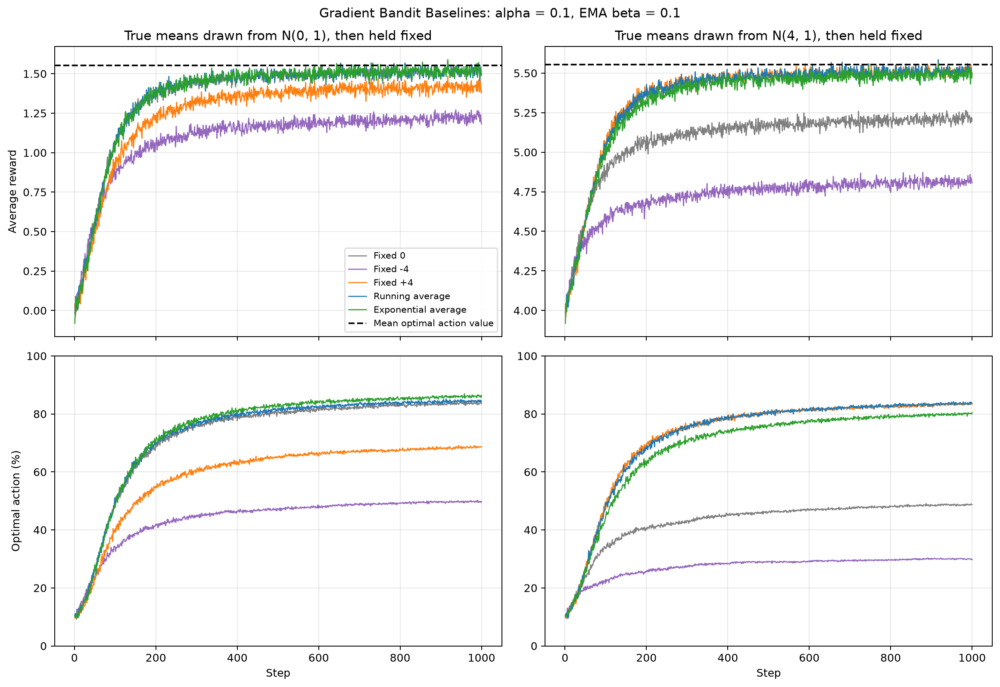
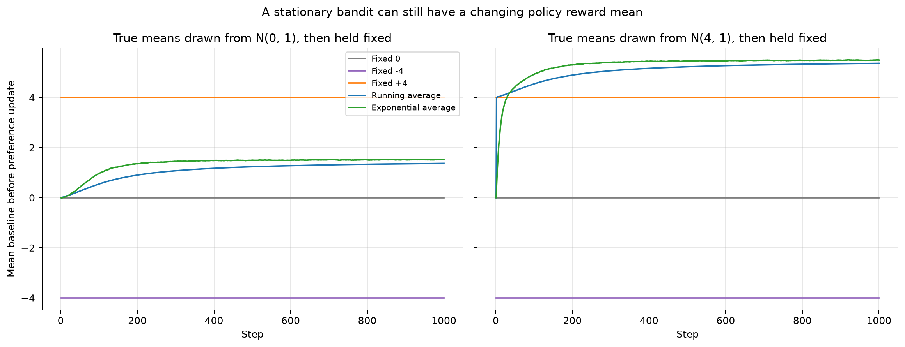
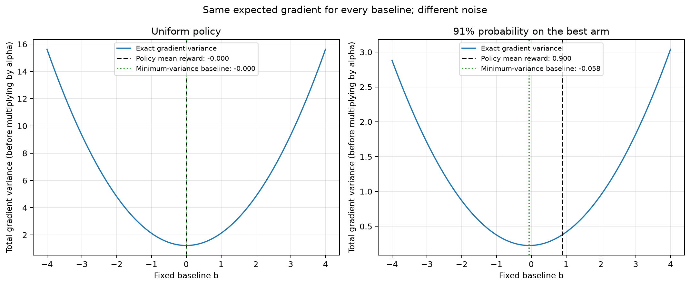

# Exercise 9 — Understanding Gradient-Bandit Baselines

## Concept: A Reference for Reinforcement

A **reward baseline** answers: *Was this reward better or worse than a reference level?* It is not an action-value estimate, a minimum acceptable reward, or a change to the environment's payoff. The agent still tries to maximize the original reward. The baseline changes the sampled learning signal.

A gradient bandit maintains preferences $H_t(a)$ and samples its action from the softmax policy

$$
\pi_t(a)=\frac{e^{H_t(a)}}{\sum_c e^{H_t(c)}}.
$$

After observing $R_t$, it updates every preference using the **old baseline** $b_t$:

$$
H_{t+1}(a)=H_t(a)+\alpha(R_t-b_t)
\left[\mathbf{1}\{a=A_t\}-\pi_t(a)\right].
$$

The difference $R_t-b_t$ is the reward relative to the reference. If it is positive, the selected action's preference increases and the other preferences decrease. If it is negative, the changes reverse. A reward can therefore be positive in absolute terms but still discourage the selected action.

For example, with ten equally likely actions, $\alpha=0.1$, and observed reward $R_t=2$:

| Baseline | Reward minus baseline | Selected preference change |
| --- | --- | --- |
| $-4$ | $6$ | $+0.54$ |
| $0$ | $2$ | $+0.18$ |
| $+4$ | $-2$ | $-0.18$ |

The reward is identical in all three cases. What changes is the sign and magnitude of reinforcement. A very low baseline can strongly reinforce even a relatively poor action; a very high baseline can discourage even a relatively good action on an individual sample.

### Why Doesn't the Baseline Change the Expected Gradient?

Hold the current policy and past history fixed. If the baseline does not depend on the current sampled action, its expected contribution cancels:

$$
\mathbb{E}\left[b_t\left(\mathbf{1}\{a=A_t\}-\pi_t(a)\right)\right]
=b_t\left(\pi_t(a)-\pi_t(a)\right)=0.
$$

Consequently,

$$
\mathbb{E}[\Delta H_t(a)\mid\text{history}]
=\alpha\pi_t(a)\left[q_*(a)-\sum_c\pi_t(c)q_*(c)\right].
$$

The expected update favors actions better than the **current policy's expected reward**, regardless of the baseline. The baseline changes the **variance of sampled updates**, not their mean at the same policy. Different noise produces different preferences and subsequent action choices, so finite learning trajectories can nevertheless differ substantially. A badly chosen baseline can increase variance rather than reduce it.

## Exercise Summary

`reinforcement_learning/playground/exercise009.py` compares five baselines on a stationary 10-armed Gaussian bandit:

- **2,000 independent trials**, each lasting **1,000 steps**; seed `42`.
- Ten true action values $q_*(a)\sim\mathcal{N}(0,1)$ sampled at each trial's start and then held fixed.
- Reward noise with standard deviation $1$; preference step size $\alpha=0.1$.
- Zero initial preferences, so the initial policy is uniform.
- A second condition adds **4 to every true mean and every observed reward**. The best action and the gaps between actions are unchanged.

Within a trial, configurations share true values and potential reward samples, but each agent sees only its selected action's reward. Every learner has its own baseline; rewards are not pooled across independent trials. The shifted condition reuses the underlying random draws. The only variables changed between learning configurations are the baseline rules:

| Configuration | Baseline rule |
| --- | --- |
| Fixed 0 | $b_t=0$; no reward subtraction |
| Fixed −4 | $b_t=-4$ |
| Fixed +4 | $b_t=4$ |
| Running average | After the preference update, $b_{t+1}=b_t+(R_t-b_t)/t$ |
| Exponential average (EMA) | After the preference update, $b_{t+1}=b_t+\beta(R_t-b_t)$, with $\beta=0.1$ |

Both adaptive baselines start at zero in the main comparison. The running average weights all past rewards equally. The EMA gives more weight to recent rewards. **$\alpha$ learns preferences; $\beta$ learns the baseline.** They are separate controls even though both default to $0.1$ here.

## Learning Results



**Results.** The horizontal axes show steps. The top panels show mean observed reward; the bottom panels show the percentage choosing the true optimal action. Left panels use means centered at zero; right panels use the same tasks shifted by +4. Gray is fixed 0, purple is fixed −4, orange is fixed +4, blue is the running average, and green is the EMA. Dashed black lines mark the mean true value of the optimal arm. All agents initially choose optimally about 10% of the time.

With rewards centered at zero, fixed 0 and the adaptive baselines perform well. Fixed −4 produces large positive reward deviations, strongly reinforcing early choices, including inferior ones. A concentrated policy samples alternatives less often, slowing correction. Fixed +4 also performs worse than the well-placed baselines: most rewards are below it, producing unnecessarily large negative updates and noisy preference changes. The good baseline is not determined by whether its sign is positive or negative; it depends on the reward scale and policy.

After adding +4, fixed 0 becomes poorly placed and fixed −4 is still farther away. Fixed +4 now behaves much better because it removes the added reward offset. The running average also adapts successfully. Thus merely changing the reward's zero point can greatly affect learning if the reference is left unchanged, even though the underlying action-ranking problem has not changed.

Over the final 200 steps, optimal-action selection was:

| Baseline | Means centered at 0 | Means centered at 4 |
| --- | --- | --- |
| Fixed 0 | 83.41% | 48.48% |
| Fixed −4 | 49.60% | 29.93% |
| Fixed +4 | 68.14% | 83.06% |
| Running average | 84.18% | 83.30% |
| Exponential average | 85.77% | 79.62% |

These are finite-run results at one preference step size, not universal rankings or convergence guarantees. The [summary CSV](assets/exercise_9_summary.csv) also records average rewards, final-window rewards, and run settings.

## Why Can an Adaptive Baseline Change in a Stationary Bandit?



**Results.** The horizontal axes are steps and the vertical axis is the baseline used **before** the preference update, averaged over trials. Colors match the learning figure. The fixed baselines remain horizontal. The blue and green baselines rise because the improving policy increasingly selects better actions. Stationarity means each action's reward distribution is fixed; it does not mean the reward distribution under a changing policy is fixed.

The running average retains early low rewards and therefore lags the improving policy. The EMA follows recent performance more closely. However, an EMA is not automatically better. In the shifted condition, it starts at zero and only moves a fraction of the way toward the first reward, while the running mean adopts the first reward immediately. The EMA's initial mismatch permits larger early preference updates; early concentration on inferior actions can have persistent effects. Recent-reward tracking also introduces baseline noise. This helps explain why the EMA's modest advantage on the left does not carry over to the right.

## A Useful Surprise: Average Reward Is Not Always the Lowest-Variance Baseline

The average reward is an accessible reference, not a general variance optimum. To isolate variance from learning dynamics, the next diagnostic holds the policy fixed and uses ten equally spaced true action values from −1 to +1, with reward standard deviation 1. It computes moments analytically rather than estimating them from a learning run.

Let $z(A)=e_A-\pi$, where $e_A$ is a one-hot vector. The sampled gradient before multiplication by $\alpha$ is $g=(R-b)z(A)$. Its total variance is

$$
\operatorname{tr}\operatorname{Cov}(g)
=\mathbb{E}\left[(R-b)^2\|z(A)\|^2\right]
-\|\mathbb{E}[g]\|^2.
$$

Because the mean gradient is independent of $b$, differentiating the first term gives the minimizing scalar baseline:

$$
b_{\mathrm{minvar}}
=\frac{\mathbb{E}[R\|z(A)\|^2]}{\mathbb{E}[\|z(A)\|^2]}
=\frac{\sum_a\pi(a)q_*(a)\|e_a-\pi\|^2}
{\sum_a\pi(a)\|e_a-\pi\|^2}.
$$



**Results.** The horizontal axes vary the fixed baseline; the vertical axes show total gradient variance, before multiplying by $\alpha^2$. Blue curves show that variance grows as the baseline moves away from its minimum. Black dashed lines mark the policy's expected reward; green dotted lines mark the minimum-variance baseline. For the uniform policy on the left, every score vector has the same squared norm, so both reference lines coincide at zero. On the right, the best arm has probability 0.91 and each other arm has probability 0.01: expected reward is 0.9, but the minimum-variance baseline is approximately **−0.058**.

Rare actions have larger score vectors in the concentrated policy and therefore matter disproportionately to gradient noise. Their reward levels pull the variance-minimizing reference away from the ordinary reward mean. The expected gradient remains unchanged as the baseline varies within either panel. The two panels have different policies, so their expected gradients need not match each other.

This diagnostic uses true action values as an **oracle illustration**, not information supplied to the learning agents. Minimizing instantaneous gradient variance also does not guarantee the best finite-horizon learning curve. An advanced extension is to estimate the numerator and denominator from past samples using weighted moving averages, rather than assuming the true values are known.

## Practical Tricks and Pitfalls

### Shift the Baseline When You Shift Rewards

For any constant $c$,

$$
(R_t+c)-(b_t+c)=R_t-b_t.
$$

If preferences, random draws, and baseline initialization are paired appropriately, shifting rewards **and** baselines produces the same updates and policy trajectory. `reward_shift_demo()` tests this with two running-average agents, starting their baselines at 0 and 4. Over 100 steps, the largest policy-probability difference was **$7.772\times10^{-16}$**, consistent with floating-point roundoff.

The initialization matters: both adaptive baselines start at zero in the main comparison, so those shifted learning runs are not exactly invariant from their first update. If a typical reward level is known, initializing the baseline near it can avoid unnecessarily large initial advantages.

### Use the Old Baseline Deliberately

The code updates preferences first and the baseline second. If the current reward is included in a sample-average baseline before updating preferences, then

$$
R_t-\bar R_t=\left(1-\frac{1}{t}\right)(R_t-\bar R_{t-1}).
$$

That convention shrinks the update, making the first one zero. It is a different update convention, not an equivalent implementation of the lagged-baseline rule used here. Keeping the reference based on preceding rewards makes the action-independence argument explicit. Arbitrarily subtracting a different baseline for each currently selected action does not generally preserve the expected gradient.

### Keep the Two Kinds of Centering Separate

Subtracting the largest preference before exponentiation stabilizes softmax numerically and leaves action probabilities unchanged. Subtracting a reward baseline changes the sampled preference update. Both involve subtraction, but they solve different problems.

Baseline choice and preference step size interact: update noise is multiplied by $\alpha^2$. If a baseline makes updates erratic, reducing $\alpha$ may help, but it also slows learning. Do not assume that the best step size for one baseline will be best for another.

## Run and Explore

```bash
python -m reinforcement_learning.playground.exercise009
```

For a smaller headless run:

```bash
MPLBACKEND=Agg python -m reinforcement_learning.playground.exercise009 --trials 200
```

Options are `--trials`, `--steps`, `--alpha`, `--beta`, `--seed`, and `--output-dir`. Defaults reproduce the three figures and summary CSV in `docs/exercises/assets/`. Reusing the default output directory overwrites those generated assets.

Try reducing `--beta` to see a slower, smoother EMA, or increasing `--alpha` to expose sensitivity to noisy advantages. Change `initial_value` in `CONFIGURATIONS` to test intermediate fixed baselines. These are experiments to investigate, not guaranteed improvements.

Reusable learning and diagnostic functions are in `reinforcement_learning/gradient_bandits.py`. Unit tests verify baseline timing, preference updates, independent trial baselines, stable softmax, analytical variance, reward-shift invariance, reproducibility, and figure generation.
