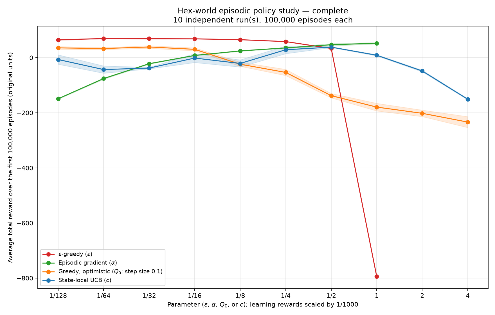
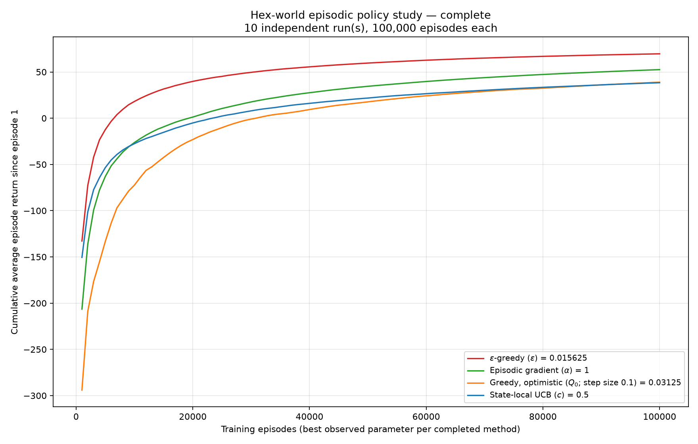

# Project 11 — Episodic Policy Parameter Study

**Status: Complete.**

Completed configuration/runs: **360 / 360**.
Each complete plotted setting averages all of the first **100,000 episodes per run**, across **10 independent run(s)**.
Master seed: `42`; fixed map seed: `42`; horizon: `500` turns; learning-curve block: `1000` episodes.
Source/settings signature: `6103676f236296810abdf36c48c8c48b9e4c6f2e61b472e7bbe9c27d792b1729`.

## Concept: actions are not episodes

The agent makes multiple movement, rest, and combat decisions before success, death, or timeout. The score is the **sum of all environment rewards in a complete episode**, not a reward per move and not the final reward alone. Faster failures do not become better merely because they contain fewer decisions.
Training includes exploration and all failures. A successful episode lasting T turns returns 100 − T; death or timeout returns −1000 − T. For N episodes and K independent runs, the plotted score is the mean of each run's sum of N episode returns divided by N. This is not a frozen-policy evaluation or a final-window score.

## Methods and experimental controls

| Method | Parameter | Episode-end update |
| --- | --- | --- |
| Epsilon-greedy | epsilon, 1/128 through 1 | Every-visit Monte Carlo sample-average action values |
| Gradient bandit adapted to episodes | alpha, 1/128 through 1 | REINFORCE, frozen within-episode softmax, pre-episode state baseline |
| Optimistic greedy | initial Q, 1/128 through 4 | Every-visit Monte Carlo, fixed step size 0.1; no epsilon exploration |
| State-local UCB | c, 1/128 through 4 | Every-visit Monte Carlo sample averages; per-state action-selection counts |

The full grid is powers of two; a custom subset may be selected. Legal actions are masked for every method. Greedy/UCB ties and untried UCB actions are selected uniformly. UCB uses Q(s,a) + c sqrt(log(N(s)+1)/N(s,a)), not a global episode counter. Its bonus is a heuristic here, not a stationary-bandit confidence guarantee.
All methods use the same state aggregation as the demo: exact player position, HP, movement allowance and enemy HP; enemy position only within three hexes; horizons of ten or more turns share a bucket. Aliasing remains: this is a restricted policy comparison, not a solution of the full observable game.
Learners start fresh for every parameter/run; no values are shared. Each episode is reseeded by master seed, run, and episode number, independent of the method and worker schedule. Thus initial enemy placement is paired. Enemy trajectories can still differ when policies consume random draws differently or end at different times.

### Credit assignment and scale

At the end of an episode, every decision receives its **return-to-go**, not just its immediate reward and not the entire starting return regardless of time. There is no future-value bootstrap. Unlike the quick demo, this study uses **no distance-potential shaping**.
Learning rewards are divided by **1000 for all methods**. This keeps the Figure-2.6-style numerical grid meaningful next to the game's −1000 failure penalty. Plot scores remain in original game units. Alpha, c, and initial Q therefore refer to this fixed learning scale; changing it changes the meaning of the grid. The smallest positive initial values are not necessarily optimistic relative to a successful policy's value.
The episodic gradient update sums alpha (G_t − b_old(s_t)) [one_hot(A_t) − pi_old(.|s_t)] over the episode. Probabilities are those actually used to sample actions. Baselines exclude the entire current episode, even if a state repeats, and are updated afterward conceptually. The gradient is summed, not divided by episode length. This is **REINFORCE**, not the ordinary immediate-reward gradient-bandit update.
This comparison changes learning rules as well as selection behavior, as Project 8 did. It cannot isolate an effect caused only by the action selector.

## Parameter sensitivity



**Results.** The horizontal axis is the parameter on a base-two logarithmic scale. The vertical axis averages the complete training horizon, including early learning and persistent exploration. Red is epsilon-greedy, green is episodic policy gradient, orange is optimistic greedy, and blue is state-local UCB. Higher is better. No optimal-policy reference line is claimed.
Bands show ±1 standard error across independent run means.

### Best completed sampled settings

| Method | Parameter | Mean episode return | Success | Death | Timeout | Mean turns on success |
| --- | ---: | ---: | ---: | ---: | ---: | ---: |
| Epsilon-greedy | 0.015625 | 69.6273 | 98.75% | 1.17% | 0.08% | 16.05 |
| Gradient bandit → episodic REINFORCE | 1 | 52.5123 | 97.66% | 2.23% | 0.11% | 21.05 |
| Greedy, optimistic initialization | 0.03125 | 38.9116 | 97.13% | 2.19% | 0.67% | 26.10 |
| State-local UCB | 0.5 | 38.3552 | 97.21% | 2.76% | 0.04% | 30.95 |

Among completed settings, **Epsilon-greedy at 0.015625** has the highest observed mean (69.6273).
- Epsilon-greedy spans -794.5564 (parameter 1) to 69.6273 (0.015625) across completed settings.
- Gradient bandit → episodic REINFORCE spans -149.1857 (parameter 0.0078125) to 52.5123 (1) across completed settings.
- Greedy, optimistic initialization spans -233.7857 (parameter 4) to 38.9116 (0.03125) across completed settings.
- State-local UCB spans -150.8444 (parameter 4) to 38.3552 (0.5) across completed settings.

These are observed maxima among completed sampled settings, not universal optima. Selection uses the same training data being displayed, not a held-out test set. A partial study's leaders can change as remaining settings finish.

## Learning across episodes



**Results.** Each curve includes every episode since episode 1; its final value equals its setting's point in the parameter chart. These are cumulative means, not raw per-episode rewards or smoothed final-policy evaluations. One setting per method is selected retrospectively by the full-horizon score. Curves can conceal recent regressions, so they should not be read as instantaneous performance.

## Interpretation and limits

Epsilon spends a continuing fraction of decisions exploring, potentially trading shorter learned routes for additional risk. UCB exploration depends on visits to each aggregate state; its estimates change as later behavior changes, violating ordinary stationary-bandit assumptions. Optimistic initialization encourages trying alternatives only until the prior estimates are corrected. REINFORCE directly changes action probabilities, with alpha controlling the response to noisy episodic returns and a baseline reducing, not removing, that noise.
These mechanisms are hypotheses for explaining measured differences, not proof that a particular bend in one seed's curve has a unique cause. Compare success/death/timeout rates alongside travel time: a fast policy with frequent deaths can have a very poor mean return. Repeat with more independent runs and additional fixed maps before generalizing.

## Reproduction and files

```bash
python -m reinforcement_learning.projects.project011 --study --episodes 100000 --runs 10 --seed 42 --map-seed 42 --max-turns 500 --block-size 1000 --parameters 0.0078125 0.015625 0.03125 0.0625 0.125 0.25 0.5 1.0 2.0 4.0 --output-dir "docs/projects/assets/project_11_runs10"
```

Add `--workers 4` to parallelize independent configurations/runs. The same command works in PowerShell. It requires Matplotlib for PNG plots. Use the same `--output-dir` on resume; study files live in its `study/` subdirectory.
`parameter_scores.csv` and `results.json` contain aggregate scores. Completed-run checkpoints contain only block summaries, never policies, raw trajectories, or large per-episode tables. Writes replace temporary files atomically. Matching completed runs are reused; an interrupted unfinished run restarts from episode 1. Changed source/settings require a different output directory. Only one study process should write a given directory.
