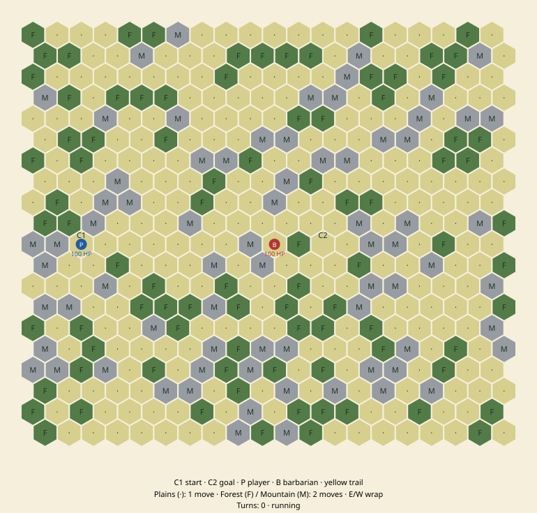
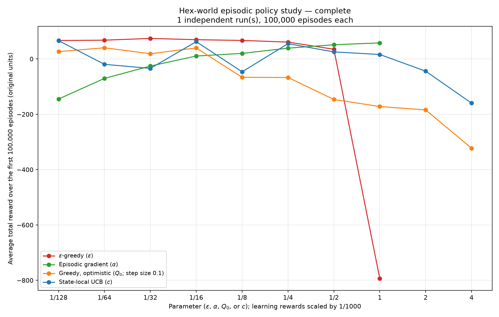

# Project 11 — Hex-World Travel

Source: `reinforcement_learning/projects/project011.py`.

Get an agent from **city 1 to city 2**, approximately ten hexes away, as quickly as possible without dying. The board is a **20 × 20 cylinder** with plains, forests, mountains, and one roaming barbarian. Terrain stays fixed across episodes; the barbarian starts at a random location each episode.

This is a small Civ-inspired simulation, not a reproduction of Civilization V's rules. In particular, **mountains are traversable** here.



The checked-in image is an initial-board preview, not a trained strategy or performance result.

## Episode-level policy comparison

The main experiment carries the parameter-study format of [Project 8](project8.md) from bandit decisions into **complete episodes**. At each parameter setting, start a fresh learner and measure average total game reward over its **first 100,000 training episodes**, including exploration, deaths, and timeouts.

[Open the generated study report and charts](assets/project_11/study/report.md). Its status distinguishes completed results from a still-running partial sweep; missing configurations are never plotted as zero. The report updates as complete configuration/runs finish.



**Results.** This is the live parameter-study chart. Each visible point represents a completed 100,000-episode configuration/run; the title identifies an incomplete sweep as **PARTIAL**. Red is epsilon-greedy, green is episodic policy gradient, orange is optimistic greedy, and blue is state-local UCB. The logarithmic horizontal axis varies the method's parameter; the vertical axis averages complete episode returns, including the cost of learning and exploration. Missing points have not finished—not scored zero. The generated report contains measured scores, success/death/timeout rates, cumulative learning curves, and interpretation limits; rankings from a partial or single-seed study are preliminary.

```bash
python -m reinforcement_learning.projects.project011 --study --episodes 100000 --runs 1 --workers 4
```

The study uses Matplotlib, already listed in `requirements.txt`. If needed, install it with `python -m pip install matplotlib`. Commands are the same in PowerShell.

### What is measured?

For parameter $\theta$, $K$ independent runs and $N=100000$ episodes per run:

$$
\widehat J(\theta)=\frac{1}{K}\sum_{k=1}^{K}\left[\frac{1}{N}\sum_{i=1}^{N}G_{k,i}^{(\theta)}\right],
\qquad
G_{k,i}=\sum_{t=0}^{T_{k,i}-1}R_{t+1}.
$$

Here $T$ counts decisions, which may include two movements within one game turn. Each episode gets equal weight regardless of its length. The main chart plots this score against the parameter on a base-two logarithmic axis, like Project 8. A second chart shows cumulative average episode return for each method's best completed setting.

This is **training performance across the entire horizon**, not reward per move, a final-window average, or a frozen-policy evaluation. The episode budget is equal across settings, but the number of decisions and computation time need not be: longer episodes contain more training interactions. Scores use the game's original reward units: success after $u$ turns returns $100-u$; death/timeout returns $-1000-u$.

### Policies and episodic credit

| Method | Parameter grid | Learning rule |
| --- | --- | --- |
| Epsilon-greedy | epsilon: $1/128,1/64,\ldots,1$ | Every-visit Monte Carlo sample averages |
| Gradient bandit adapted to episodes | alpha: $1/128,1/64,\ldots,1$ | Episodic softmax policy gradient, **REINFORCE**, with a prior-episode state baseline |
| Greedy with optimistic initialization | initial Q: $1/128,1/64,\ldots,4$ | Every-visit Monte Carlo; fixed step size 0.1; epsilon zero |
| State-local UCB | c: $1/128,1/64,\ldots,4$ | Every-visit Monte Carlo sample averages; state-local selection counts |

There are **36 configurations**, or **3.6 million full games per independent run**. All use the same fixed map, game rules, legal-action masks, and state aggregation described below. Independent runs do not share learned estimates.

The ordinary gradient-bandit update cannot simply use each move's immediate reward: the useful consequence may be several turns away. Instead, every decision receives its observed return-to-go after the episode ends. REINFORCE uses the probabilities that actually selected each action, and a baseline excluding the whole current episode—even when a state repeats. Its gradients are summed over decisions, not divided by episode length.

Action-value estimates/preferences stay fixed within an episode. UCB selection counts advance at each decision; Monte Carlo update counts advance separately at episode-end updates, so repeated state–action visits use correct averaging denominators. UCB's confidence bonus is state-local, not based on a global episode number.

Unlike the quick Q-learning demo, the study uses **no bootstrap and no distance shaping**. Every method learns from rewards divided by **1000**, to make the shared numerical parameter grid usable with the game's large failure penalties. Reported scores remain unscaled. Initial Q and UCB c are in these normalized units; some small positive initial Q values are not optimistic relative to a successful strategy.

This is a comparison of **selection and learning methods**, not an experiment that changes only an action-selection function. State aggregation and changing continuation policies also mean the usual stationary-bandit guarantees do not apply. The report separates plausible explanations from empirical findings.

### Repetition, runtime, and resume

`--runs 1` is a single-seed-per-setting study, so no uncertainty bands are drawn. Use `--runs 3` (or more) and a **new output directory** for independent repetitions; bands then show one standard error across run means, not across correlated episodes in one learning trajectory.

Each episode's RNG seed depends only on the master seed, run index, and episode number. Methods therefore share initial enemy placements and initial RNG seeds, independent of worker scheduling. Different actions can still yield different enemy trajectories.

The full sweep can take substantial time. Output stays small: there are no raw per-decision tables or policy snapshots. Files are written under `--output-dir/study/`:

- `report.md`: methodology, current completion status, measured winners, and interpretation limits.
- `parameter_study.png`: the Project-8-style parameter chart.
- `learning_curves.png`: cumulative episode averages for the best completed setting per method.
- `results.json` and `parameter_scores.csv`: aggregate scores and reproducibility settings.
- `checkpoints/`: summaries of **completed** configuration/runs, including learning-curve blocks.

Re-run the same command and output directory to reuse completed runs. Unfinished runs restart from episode 1. Settings and source signatures are checked before reuse; changed game or learner code requires a new directory. Files are replaced atomically, avoiding the interrupted-in-place CSV problem encountered in Project 10. Only one study should write a directory at a time.

`--parameters` accepts a smaller increasing grid and `--block-size` controls learning-curve summary spacing. For a quick validation run, use a **separate output directory** and an honestly labeled shorter horizon:

```bash
python -m reinforcement_learning.projects.project011 --study --episodes 100 --parameters 0.125 1 --output-dir results/hex-study-smoke
```

A short run does not stand in for the requested first-100,000-episode results. Study implementation lives in `reinforcement_learning/projects/project011_study.py`; the CLI remains Project 11. The existing `--epsilon`, `--alpha`, and `--evaluate` settings apply to the demo, not the study grid.

## Run the quick demo

After [installing the repository](../getting-started/installation.md), these commands work in macOS/Linux shells and Windows PowerShell:

```bash
python -m reinforcement_learning.projects.project011 --episodes 1000 --evaluate 100
```

No third-party runtime dependencies are needed for this demo (the policy-study charts require Matplotlib). The program trains a small masked Q-learning baseline, then evaluates it without exploration or learning. It writes three small files under `docs/projects/assets/project_11/`:

- `map.svg`: the initial state of the first evaluation episode; open it in a browser.
- `episode.svg`: that episode's final state, with visited tiles outlined yellow.
- `summary.md`: separate training and evaluation statistics.

The SVGs are static snapshots, **not an interactive game or animation**. Re-running the command replaces these three outputs. No Q-table, large CSV, or full episode dataset is saved. Learning starts fresh on each invocation.

For an untrained baseline:

```bash
python -m reinforcement_learning.projects.project011 --episodes 0 --evaluate 20 --output-dir results/hex-baseline
```

Other options: `--seed 42`, `--map-seed 42`, `--max-turns 500`, `--epsilon 0.1`, `--alpha 0.1`, and `--output-dir PATH`. `--episodes` must be nonnegative; `--evaluate` must be positive. Progress prints every 100 training episodes.

## The board

- Positions use **odd-row-offset hex coordinates**: `(column, row)`. Odd rows are shifted right.
- There are six movement directions: east, northeast, northwest, west, southwest, southeast.
- North and south are blocked. There is no vertical wrap.
- East and west wrap: moving east from column 19 reaches column 0 on the same row. An agent can keep moving east indefinitely, revisiting the same terrain, until an episode ends.
- This is a finite repeating world, **not an infinitely growing map**. Diagonal movement also wraps horizontally.
- Hex distance is the shortest path across the wrapped board, ignoring terrain costs. Adjacency, city defenses, and threat detection use this distance, including across the seam.
- City 1 is `(2, 10)` and city 2 is `(12, 10)`, exactly ten hexes apart on the default map. Both are plains.
- Terrain is drawn once with a separate map RNG: 60% plains, 25% forest, 15% mountain probabilities. These are generation probabilities, not exact tile quotas.
- All terrain is traversable, so the two cities are connected. Terrain is not regenerated on reset.

Both units and the whole map are observable. There is no fog of war.

## Player movement and turns

A fresh player turn has **2 movement points**. Every `step()` is a decision, not necessarily a whole turn.

| Action | Effect |
| --- | --- |
| Enter plains | Spend 1 movement point |
| Enter forest | Spend 2 movement points |
| Enter mountain | Spend 2 movement points |
| Rest / do nothing | Heal 10 HP, capped at 100; consume the rest of the turn |
| Attack adjacent barbarian | Deal damage; consume the rest of the turn |

If only one point remains, entering a forest or mountain is still allowed and consumes that point: costs saturate at zero; they do not create debt for the next turn. Thus:

```text
plains → plains       two moves, one turn
forest                 one move, one turn
mountain               one move, one turn
plains → forest        two moves, one turn
plains → rest          one move, heal 10, end turn
```

The cost belongs to the **destination** tile. Rest is legal at full health but gives no extra HP. It can be selected after the first plains move; this initial ruleset does not require an entire stationary turn to heal.

Units cannot occupy the same tile. Moving into the barbarian is blocked; use the separate attack action from an adjacent hex. Killing it does not automatically move the player into its former tile.

The shared `allowed_actions(board, state)` masks illegal movement and attacks in behavior and Q-learning targets. Illegal direct calls raise `ValueError` without advancing the turn, moving units, or consuming random draws.

## Barbarian behavior

Both units normally start with **100 HP**. The barbarian spawns uniformly on any tile other than occupied city 1; it can start in terrain, near a city, or on city 2. It does not respawn during an episode.

The barbarian acts **once after the player finishes a turn**, not between two plains moves:

1. If already adjacent to an unprotected player, make one attack decision.
2. Otherwise, roam first, then make an attack decision if now adjacent to an unprotected player.
3. If an initially adjacent barbarian declines to attack, it roams instead and does not get a second attack roll.
4. Apply city-defense damage at its ending position.

Roaming selects uniformly from staying put and neighboring tiles not occupied by the player. It can move **at most one hex**, regardless of terrain cost. It obeys the same north/south bounds and east/west wrap. It is a random roamer, not a pathfinding pursuer, and does not intentionally avoid city defenses.

When adjacent and able to attack:

```python
if barbarian_health > player_health:
    probability = 1.0
else:
    probability = barbarian_health / 100
```

Examples:

| Player HP | Barbarian HP | Attack probability |
| --- | --- | ---: |
| 90 | 91 | 100% |
| 90 | 89 | 89% |
| 90 | 90 | 90% |
| 100 | 100 | 100% |

The probability is **not** `barbarian_health / player_health`. It uses current health after any player healing or damage dealt that turn. A successful decision always hits; there is no second accuracy roll.

## Editable combat model

Both units use the same pure function:

```python
combat_damage(attacker_health: int, defender_health: int) -> int
```

The initial formula is:

```python
min(defender_health, max(1, round(30 * attacker_health / defender_health)))
```

It deals 30 damage between equal-health units, limited by the defender's remaining HP. A weaker attacker deals less damage; a stronger attacker deals more, up to a lethal strike. Health stays between 0 and 100. Python's standard `round()` determines integer damage.

There is **no immediate counterattack** inside a strike. After a player attack ends the turn, a surviving barbarian gets its normal phase and may attack then. A barbarian killed by the player's attack cannot retaliate.

Change this function later, or inject another model without editing the turn loop:

```python
from reinforcement_learning.projects.project011 import HexEnvironment


def fixed_damage(attacker_health: int, defender_health: int) -> int:
    return 20


environment = HexEnvironment(damage_function=fixed_damage)
```

An injected function must return a nonnegative integer. The environment caps it at remaining defender HP. There are no terrain combat modifiers or combat/healing reward bonuses.

## Cities and termination order

- If the player ends their turn **on city 1**, the barbarian cannot attack them. Protection does not extend to adjacent player tiles.
- At the **end of every barbarian turn**, it takes **30 damage** if its ending position is within two hexes of either city, including distance zero.
- City damage happens **once**, not twice if the two radii overlap on a custom map. It is applied after movement/attacking, not when merely passing into range.
- City defenses still fire if the barbarian has just killed the player. Both units can die during the same turn; that is a player-death outcome.

An episode ends when:

1. The player enters city 2: immediate success, before any barbarian response.
2. The player reaches zero HP: death, checked before the turn limit.
3. The player has completed 500 turns without either outcome: timeout.

A partial final arrival turn counts as one travel turn. Two plains moves on the final permitted turn are allowed, and reaching the goal on turn 500 succeeds. There is no 501st turn. At most two player decisions occur per turn.

## Rewards and baseline learning

The environment provides:

- **−1 per turn used**, not per movement decision.
- **+100 for reaching city 2**.
- **−1000 for death or timeout**.
- Zero on a nonterminal first plains move.

Thus success after $T$ turns returns $100-T$; failure returns $-1000-T$. Any successful trajectory within the default limit scores above any failed trajectory. This encourages fast survival, but maximizing expected return is not a hard guarantee against risk.

The included `QLearningAgent` uses legal-action-masked epsilon-greedy Q-learning, gamma 1, fixed alpha 0.1, epsilon 0.1, and **zero initial estimates**. It is a baseline, not a solved optimal strategy.

To help early exploration find the goal, learning uses potential-based shaping:

$$
\Phi(s) = -\frac{\operatorname{hexDistance}(s.\mathrm{player},\mathrm{city2})}{2},
\qquad
r' = r + \Phi(s') - \Phi(s).
$$

The potential is **zero at every terminal outcome**, including death and timeout. Over a complete episode the extra terms telescope to a fixed starting bonus (5 on the default map). Loops, healing, fighting, and death cannot repeatedly collect free shaping reward. Printed returns are the original environment rewards, not shaped training rewards.

### State and approximation

`GameState` includes exact player position/HP, barbarian position/HP, movement points left, elapsed turns, and outcome. The map and rules are fixed environment configuration. A dead barbarian has position `None` and HP zero.

The learner intentionally aggregates some observations to avoid an enormous table:

- Exact player position, HP, and movement allowance are retained.
- Barbarian HP is retained. Its exact position is retained only within three hexes of the player; more distant positions share a key.
- Remaining horizons of ten or more turns share a bucket; fewer than ten remaining turns are distinct.

This aliases different distant threats and long-horizon states. It is **not an exact Markov-state solution**, and fixed-step-size learning does not prove convergence. The environment still exposes full states for replacing the learner later. No map is pooled with a different map in the same learner.

Evaluation uses the frozen estimates with epsilon zero, though greedy ties are still broken randomly. It has a separate unit RNG from training. The small summary reports success, death, timeout, successful travel time, and unshaped return separately for training and evaluation.

## Python API

```python
from reinforcement_learning.projects.project011 import (
    HexEnvironment,
    HexMap,
    QLearningAgent,
    allowed_actions,
    run_episode,
)

board = HexMap.generate(seed=42)
environment = HexEnvironment(board, seed=42)
agent = QLearningAgent(board, seed=43)

for _ in range(100):
    result = run_episode(environment, agent)

trace = []
result = run_episode(environment, agent, learn=False, trace=trace)
print(result.outcome.value, result.turns, result.reward)

state = environment.reset()
print(allowed_actions(board, state))
```

- `HexEnvironment.reset()` starts a fresh episode at city 1. It can also abandon an existing episode. Optional `reset(seed=...)` restarts its RNG for paired policy-study episodes; without a seed, the stream continues as before.
- `step(action)` returns `StepResult(state, reward, events)`.
- `result.terminated` identifies success/death; `result.truncated` identifies timeout; `result.done` covers all three. Since the finite horizon is part of this task, the learner does not bootstrap on timeout.
- Calling `step()` before reset or after an episode ends raises `RuntimeError`.
- `reset(barbarian_position=..., player_health=..., barbarian_health=...)` supports deterministic scenarios; `barbarian_health=0` disables the enemy for an experiment.
- `Rules(max_turns=500, heal_amount=10, city_damage=30, city_radius=2)` configures the environment. Pass the same rules to its learner.
- `HexMap(tiles, city1, city2)` accepts a custom immutable terrain layout. Horizontal width must be at least three; height at least one.
- `save_svg(board, state, path, trail=...)` renders a snapshot using only the standard library.

## Preliminary completed-point example

The first completed 100,000-episode comparisons at parameter **1/128** illustrate why travel speed alone is not the objective. Epsilon-greedy averaged **66.4944** return with **98.668%** success and **18.10 turns** on successful trips. UCB averaged **65.8928** with **98.336%** success and **14.43 successful-trip turns**. UCB's successful journeys were shorter, but its greater failure rate offset that advantage under the large failure penalty. These are observed single-run results at one setting, not a ranking of the full methods or a statistically established difference. See the generated report for the expanding parameter comparison.

## Tests

```bash
python -m unittest discover -s tests -p "test_project011*.py" -v
```

Tests cover both row parities, reciprocal neighbors, seam crossing and bounded edges, graph-checked hex distances, fixed terrain, movement costs, partial turns, healing, collision and attack masks, probability thresholds, health-scaled/injected damage, barbarian timing, safe-city behavior, both defense radii, simultaneous deaths, arrival priority, the exact 500-turn cutoff, shaping, legal Q targets, frozen evaluation, reproducibility, and small SVG/report output. Study tests additionally verify returns-to-go, every-visit averaging, masked state-local UCB, stored-policy REINFORCE gradients, pre-episode baselines, unscaled whole-episode scoring, independent-run uncertainty, paired seeds, deterministic parallel scheduling, atomic checkpoints, validated resume, and correctly labeled partial plots.
