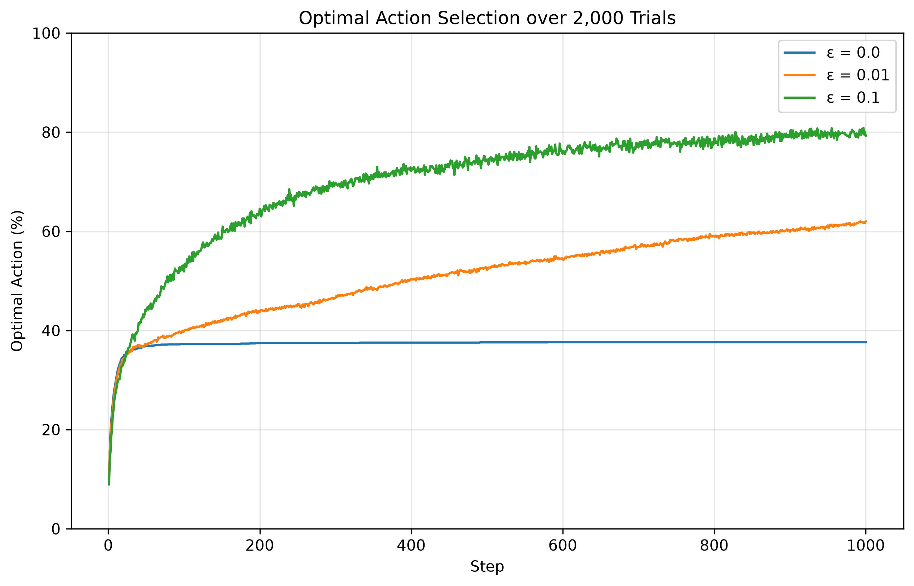

# Project Plots

Figures produced by `reinforcement_learning.projects.project002.plot_results`.

## Project 2

Average reward across trials for ε ∈ `{0.0, 0.01, 0.1}` (default script settings: 2000 trials, 1000 steps):

Percent of optimal actions selected over the same runs:

