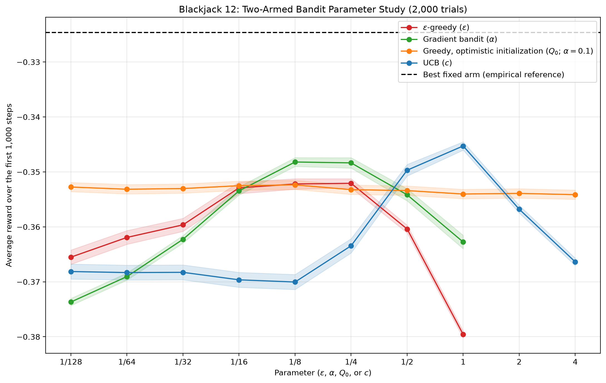

# Project 8 — A Two-Armed Blackjack Bandit

## Concept

This project has **one learning state and two actions**: from a two-card player total of 12, either hit once and then stand, or stand immediately. The agent does not condition its choice on the exact player cards, whether the hand is soft, or the dealer upcard. It learns which action is better **on average over randomly dealt 12s and dealer hands**.

The physical hands vary, but they are not separate learning contexts. Restoring and reshuffling the two-deck shoe after every round gives each action a stationary reward distribution:

$$
q_*(a)=\mathbb{E}[R\mid A=a,\ \text{initial player total}=12].
$$

There is no second player decision, no state transition to learn, and no future-value bootstrap. This replaces the previous multi-context Project 8 with an ordinary **two-armed bandit**.

The goal is to reproduce the **parameter-study format of Figure 2.6 in Sutton and Barto**, not its exact curves. The book uses a different reward-generating testbed. Here, each plotted point measures an algorithm's average reward over its first 1,000 blackjack decisions, exposing the tradeoff between learning quickly and spending rewards on exploration.

## The Game

Each round starts with two standard 52-card decks, without jokers. Cards are drawn **without replacement within the round**; the complete shoe is restored and shuffled for the next round. Ace through nine each have eight physical cards, while 10, J, Q, and K are represented together by 32 ten-valued cards.

The player receives a random two-card hand conditioned on a blackjack total of 12:

| Hand | Physical unordered pairs | Conditional probability |
| --- | --- | --- |
| A–A (soft 12) | 28 | $28/504$ |
| 10–2 | 256 | $256/504$ |
| 9–3 | 64 | $64/504$ |
| 8–4 | 64 | $64/504$ |
| 7–5 | 64 | $64/504$ |
| 6–6 | 28 | $28/504$ |

These six hand types are **not equally likely** when drawing actual cards. For example, there are $32\times8=256$ ten–two pairs but only $\binom{8}{2}=28$ ace pairs. The implementation samples these weights, removes the two player cards, and shuffles the remaining 102 cards. This has the same relevant deal distribution as repeatedly shuffling all 104 cards until the first two total 12, without the cost of rejected deals.

The dealer then receives an upcard and a hole card from the same shoe. **Neither card is an input to the agent.** They still determine the reward: after the player's decision, the dealer hits below 17 and stands on all 17s, including soft 17.

- **Hit then stand:** draw exactly one player card, then stop. A player bust loses immediately.
- **Stand:** draw no player card.
- **Reward:** win $+1$, loss $-1$, push $0$.
- Dealer blackjack beats a player's three-card 21. There is no initial player blackjack because every starting total is 12, so the earlier $+1.5$ bonus cannot occur.
- There is no doubling, splitting, insurance, or sequence of player decisions.

## Algorithms and Parameters

All methods start fresh for each trial and parameter setting. Greedy ties are broken uniformly.

| Method | Tuned parameter | Range | Fixed settings |
| --- | --- | --- | --- |
| $\varepsilon$-greedy | $\varepsilon$ | $1/128$ to $1$ | $Q_0=0$; sample-average updates |
| Gradient bandit | $\alpha$ | $1/128$ to $1$ | Zero preferences; running-average reward baseline |
| Greedy with optimistic initialization | $Q_0$ | $1/128$ to $4$ | $\varepsilon=0$; constant update step size $0.1$ |
| UCB | $c$ | $1/128$ to $4$ | $Q_0=0$; sample-average updates |

Each range uses powers of two: $1/128,1/64,\ldots,1,2,4$, omitting values above one for $\varepsilon$ and gradient $\alpha$. The gradient cap is an experimental choice requested here, not a general mathematical restriction on gradient-bandit step sizes. There are **36 method–parameter configurations**.

### Action-Value Methods

Epsilon-greedy chooses a uniformly random arm with probability $\varepsilon$ and a greedy arm otherwise. Its estimates, and UCB's estimates, use

$$
Q(A_t)\leftarrow Q(A_t)+\frac{R_t-Q(A_t)}{N(A_t)},
$$

where $N(A_t)$ includes the current selection. UCB selects an untried arm first; otherwise it maximizes

$$
Q_t(a)+c\sqrt{\frac{\ln t}{N_t(a)}}.
$$

The optimistic agent instead initializes both estimates to the tested $Q_0$ and updates the selected estimate with

$$
Q(A_t)\leftarrow Q(A_t)+0.1\,[R_t-Q(A_t)].
$$

It has no explicit random exploration beyond tie-breaking. Disappointing rewards lower the selected estimate, making the other arm more attractive. The horizontal-axis parameter for this curve is **$Q_0$, not the fixed step size $0.1$**.

### Gradient Bandit

The gradient agent learns preferences $H_t(a)$ rather than reward estimates. It samples from a stable softmax policy and updates both preferences:

$$
\pi_t(a)=\frac{e^{H_t(a)}}{\sum_b e^{H_t(b)}},
\qquad
H_{t+1}(a)=H_t(a)+\alpha(R_t-\bar R_{t-1})
\left[\mathbf{1}\{A_t=a\}-\pi_t(a)\right].
$$

The baseline $\bar R_{t-1}$ is the mean of preceding rewards, initialized to zero. It is updated only after the preference update, so the current reward does not enter its own baseline.

## Project Summary

`reinforcement_learning/projects/project008.py` uses **2,000 independent trials per configuration**, **1,000 steps per trial**, and seed `42`. The plotted score is

$$
\widehat J(\theta)
=\frac{1}{2000}\sum_{i=1}^{2000}
\left(\frac{1}{1000}\sum_{t=1}^{1000}R_{i,t}^{(\theta)}\right).
$$

This averages **all of the first 1,000 rewards**, including initial learning and exploration—not just the final step or a post-training evaluation.

Configurations share a collection of independently shuffled deals. For comparison efficiency, the simulator calculates both possible outcomes of each deal, respecting which card a hit removes before the dealer plays. Each agent receives **only its selected action's reward**, never the alternative outcome, card information, or future rewards. The independent trials are vectorized in `BanditBatch`; no estimates are shared between trials.



**Results.** The horizontal axis is the tuned parameter on a base-two logarithmic scale; the vertical axis is average reward over the first 1,000 steps. Red is epsilon-greedy, green is the gradient bandit, orange is optimistic greedy with fixed step size $0.1$, and blue is UCB. Shaded bands show one standard error, calculated across the independent trial-average rewards. The dashed line is the empirical mean of always selecting the better arm, not a learned policy or an exact theoretical bound.

The sampled arm means were approximately **−0.32462 for hit-then-stand** and **−0.43502 for stand**. Hitting is better for this aggregate task, but both have negative mean rewards. Consequently, better learning means making the average reward **less negative**, not necessarily profitable.

- **Epsilon-greedy:** very small $\varepsilon$ can leave the agent favoring the wrong arm after unlucky early outcomes. Moderate exploration improves identification. Large $\varepsilon$ repeatedly chooses the worse arm even after learning. At $\varepsilon=1$, the policy is uniformly random and approaches the mean of the two arm values, about $-0.37982$.
- **Gradient bandit:** small $\alpha$ changes preferences too slowly within the 1,000-step budget. Values near $1/8$–$1/4$ perform better here. Larger updates react more strongly to noisy individual wins and losses and can concentrate probability on the wrong arm, reducing performance.
- **Optimistic greedy:** the curve is comparatively flat. Both arms have negative mean rewards, so even the smallest positive $Q_0$ is optimistic. Initial disappointment encourages switching at every tested setting, while the fixed step size keeps estimates sensitive to subsequent reward noise. Larger initialization does not provide a lasting advantage in this experiment.
- **UCB:** small $c$ provides too little encouragement to revisit an arm whose first samples were unfavorable. Increasing $c$ improves learning up to the observed best setting of $c=1$. Values $2$ and $4$ spend more of the finite budget sampling the inferior arm, lowering average reward again.

The best sampled settings in this run were:

| Method | Best sampled parameter | Average reward |
| --- | --- | --- |
| Epsilon-greedy | $\varepsilon=1/4$ | −0.35208 |
| Gradient bandit | $\alpha=1/8$ | −0.34820 |
| Optimistic greedy | $Q_0=1/8$ | −0.35236 |
| UCB | $c=1$ | −0.34528 |

Nearby settings can differ by less than their sampling uncertainty, especially on the optimistic curve. These are empirical maxima over this grid and horizon, not universal optimal hyperparameters. The point of the figure is parameter sensitivity and the cost of exploration during learning.

## Running the Comparison

```bash
python -m reinforcement_learning.projects.project008
```

For a faster check with fewer trials but the same 1,000-step horizon:

```bash
MPLBACKEND=Agg python -m reinforcement_learning.projects.project008 --trials 100
```

Options are `--trials`, `--steps`, `--seed`, and `--output-dir`. The defaults reproduce the figure above and save:

- `docs/projects/assets/project_8_parameter_study.png`
- [Parameter scores and standard errors](assets/project_8_parameter_study.csv), including trial count, horizon, and seed.

Reusable finite-shoe dealing and reward logic live in `reinforcement_learning/blackjack_twelve.py`. This module reuses the ace-aware `hand_value()` helper from `reinforcement_learning/blackjack.py`, but does **not** use the earlier infinite-deck contextual environment. Tests cover shoe composition, conditional hand weights, one-action rewards, algorithm updates, parameter limits, reproducibility, and averaging across the complete horizon.
